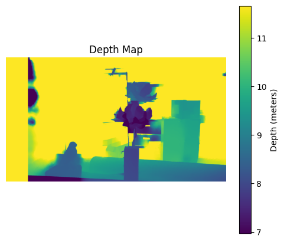
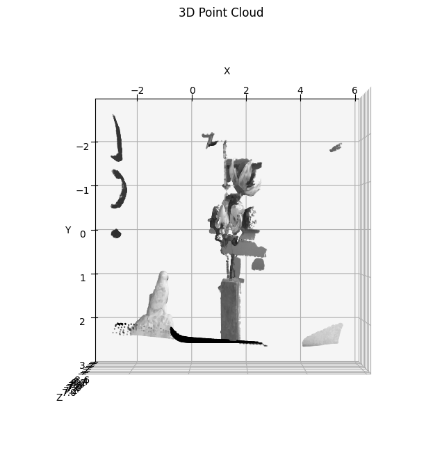

# Stereo Depth Estimation and 3D Point Cloud Reconstruction

## Overview

This project presents a complete stereo vision pipeline for depth estimation and 3D scene reconstruction using classical computer vision techniques.

The system takes a pair of stereo images and produces both a dense depth map and a 3D point cloud representation of the scene.

The main objective is not only to estimate depth, but also to **isolate specific objects in the scene based on their distance**, enabling spatial understanding of the environment.

---

## Methodology

The pipeline consists of the following steps:

### 1. Image Preprocessing

Stereo images are enhanced using **Contrast Limited Adaptive Histogram Equalization (CLAHE)** to improve local contrast and increase feature visibility, which is critical for accurate matching.

---

### 2. Disparity Estimation

Depth cues are obtained by computing the disparity map using the **Semi-Global Block Matching (SGBM)** algorithm.
This method provides a good balance between computational efficiency and accuracy.

---

### 3. Disparity Refinement

To improve the quality of the disparity map and reduce noise, a **Weighted Least Squares (WLS) filter** is applied.
This step enhances edge preservation and reduces artifacts.

---

### 4. Depth Computation

The refined disparity is converted into metric depth using the standard stereo vision formula:

Z = (f × B) / (d + doffs)

where:

* f is the focal length
* B is the baseline
* d is the disparity
* doffs is the disparity offset

Since doffs = 0 in this dataset, the formula simplifies to:

Z = (f × B) / d

---

### 5. Depth-Based Filtering

A depth threshold is applied to isolate objects located within a specific range.

In this implementation, objects within approximately **7–8.5 meters** are extracted, allowing clear separation of the target region (flower and bird) from the surrounding scene.

---

### 6. 3D Reconstruction

The depth map is projected into 3D space using the camera intrinsic parameters, generating a dense point cloud representation.

---

### 7. Visualization

The resulting point cloud is visualized using Matplotlib with a manually selected viewpoint that maximizes structural clarity of the scene.

---

## Results

The pipeline successfully reconstructs a meaningful 3D representation of the scene and isolates key objects based on spatial distance.

### Depth Map



### Filtered 3D Point Cloud




## Camera Calibration

The camera parameters used in this project were obtained from a pre-calibrated stereo dataset.

Intrinsic matrix:

K =
[1733.74   0       792.27
0       1733.74   541.89
0         0         1     ]

Stereo parameters:

* Baseline (B): 0.53662 meters
* Disparity offset (doffs): 0
* Image resolution: 1920 × 1080

These parameters were used directly for metric depth reconstruction.

---

## Key Contributions

* Implementation of a complete stereo vision pipeline from scratch
* Integration of SGBM with WLS filtering for improved disparity quality
* Depth-based segmentation to isolate objects of interest
* 3D reconstruction using real camera parameters
* Practical demonstration of spatial filtering in real-world scenes

---

## Technical Details

* Programming Language: Python
* Libraries: OpenCV (with ximgproc), NumPy, Matplotlib
* Input Resolution: 1920×1080
* Disparity Method: StereoSGBM
* Post-processing: WLS filtering + bilateral smoothing

---

## Limitations

* Sensitive to textureless regions and illumination changes
* Performance depends on disparity quality
* Visualization limited by Matplotlib rendering capabilities

---

## Future Work

* Incorporate full stereo camera calibration pipeline
* Explore deep learning-based stereo matching methods
* Use Open3D for interactive 3D visualization
* Extend the system to real-time robotic perception applications

---

## How to Run

```bash
pip install opencv-contrib-python numpy matplotlib
python src/main.py
```

---

## Research Relevance

This project reflects fundamental concepts in:

* Computer Vision
* Depth Estimation
* 3D Reconstruction
* Robotic Perception

It demonstrates the ability to design and implement a complete perception pipeline, bridging theoretical understanding with practical implementation.

---

## Author

Aya Kheir Beq
MSc in Mechatronics Engineering
Focus: Computer Vision, Robotics, Intelligent Systems
